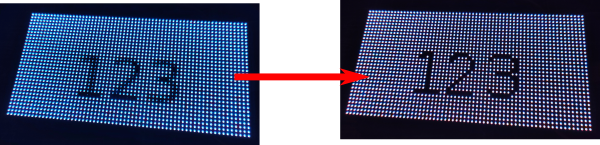

# Using your LED matrix as a regular screen for Qt applications

This project provides a Qt6 Platform plugin that you can enable for any Qt application, to allow using a LED matrix as if it was a regular screen. This way you can use the Qt rendering stack to make nice displays and animations, or interactive UIs. QML is also supported:


# How to use it
* Build the [rpi-rgb-led-matrix library](https://github.com/hzeller/rpi-rgb-led-matrix)
* Get the source code
* Build the plugin
```
mkdir build
cd build
cmake .. -DLIBRGBMATRIX_INCLUDE_DIR:PATH=/...../rpi-rgb-led-matrix/include -DLIBRGBMATRIX_LIBRARY_DIR:PATH=/...../rpi-rgb-led-matrix/lib
make
```
* Copy the generated library into a `plugins/platforms` directory
* Start your Qt application with the proper platform and options:
```
QT_PLUGIN_PATH=/...../rpi-rgb-led-matrix/plugins/ ./myawesomeqtapp -platform rpi-rgb-led-matrix:rows=32:cols=64:brightness=20:enable-fonts
```

# Settings
A lot of settings are available, depending on how you intend to use your LED matrix. Most of them are settings of the inner library, so please [refer to its great documentation for further details](https://github.com/hzeller/rpi-rgb-led-matrix?tab=readme-ov-file#types-of-displays).
| Setting | Possible values | Default value | Documentation |
| --- | --- | --- | --- |
| enable-fonts | _Present or not_ | _Not present_ | Load the system fonts database in order to render text |
| gpio-mapping | <ul><li>regular</li><li>adafruit-hat</li><li>adafruit-hat-pwm</li><li>compute-module</li></ul> | regular | Name of used GPIO mapping used |
| rows | 1-... | 32 | Number of rows on your matrix |
| cols | 1-... | 32 | Number of columns on your matrix |
| chain | 1-... | 1 | Number of daisy-chained panels |
| parallel | 1-3 | 1 | Number of parallel chains |
| multiplexing | 0-18 | 0 | Multiplexing mode |
| pixel-mapper | <ul><li>U-mapper</li><li>V-mapper</li><li>Rotate=[90,180,270]</li><li>Mirror=[H,V]</li></ul> | _empty_ | Chainable list of pixel mappers that allow you to arrange pixels in a different way. Please note that the syntax is slightly different from the original library setting, because ':' and ';' can't be used in this context. So instead of writing `U-mapper;Rotate:90`, you would write`U-mapper+Rotate=90` |
| pwm-bits | 1-11 | 11 | Number of PWM bits |
| brightness | 0-100 | 100 | Display brightness |
| scan-mode | 0-1 | 0 | Scan mode, progressive (0) or interlaced (1) |
| row-addr-type | 0-4 | 0 | Adressing of rows |
| show-refresh | _Present or not_ | _Not present_ | Display the refresh rate in the console |
| limit-refresh | 0-... | 0 | When >0 limit the maximum refresh rate to this value |
| inverse | _Present or not_ | _Not present_ | Inverse colors |
| rgb-sequence | A triplet or `R`, `G` and `B` in any order | RGB | Indicates how pixels colors are given. This is pretty useless in this context, because the plugin will always give the colors in RGB order, but I prefer to let it open in case you somehow need it |
| pwm-lsb-nanoseconds | 0-... | 130 | PWM Nanoseconds for LSB
| pwm-dither-bits | 0-2 | 0 | Time dithering of lower bits |
| no-hardware-pulse | _Present or not_ | _Not present_ | Disable hardware pin-pulse generation |
| panel_type | <ul><li>_empty_</li><li>FM6126A</li><li>FM6127</li></ul> | _empty_ | Needed to initialize special panels |
| slowdown-gpio | 0-4 | 1 | Slowdown GPIO. Needed for faster Pis/slower panels |
| daemon | _Present or not_ | _Not present_ | Make the process run in the background as daemon |
| no-drop-privs | _Present or not_ | _Not present_ | Don't drop privileges from 'root' after initializing the hardware |
| drop-priv-user | _username_ | daemon | Drop privileges to this username or UID |
| drop-priv-group | _groupname_ | daemon | Drop privileges to this groupname or GID |

# Tips
## Designing an UI with a very small screen size
Even if you have the highest matrix resolution, it is really huge compared to a classic PC screen. So if you develop on your PC, you can use QT_SCALE_FACTOR to render your application at viewable size, for example:

```QT_SCALE_FACTOR=3 ./myamazingqtapp```

Please note however that this gave me trouble with loading SVG files with large factors, for some reason...

## Disabling font antialiasing
Depending on the visual style of your application and the font you are using, you may want to disable font antialiasing. This can be achieved quite easily:
```c++
QApplication app(argc, argv);

QFont font;
font.setStyleStrategy(QFont::NoAntialias);
app.setFont(font);
```



# Possible improvements
* The current implementation doesn't use the double-buffering mechanism provided by the library. In some cases this could improve performances, and possibly flickering, so it could be a good idea to have it as an option.
* Add scaling option to allow development of an UI at normal scale, then scale it down once on the device. This could be helpful to use the regular Qt widgets, although this is probably a bad idea in most cases. Moreover, this would be a huge decrease of peformances, because you would have to render first in high resolution, then scale down an image. However, if you feel a strong need for this feature, feel free to open an issue (or a PR !) so that it can be added.
